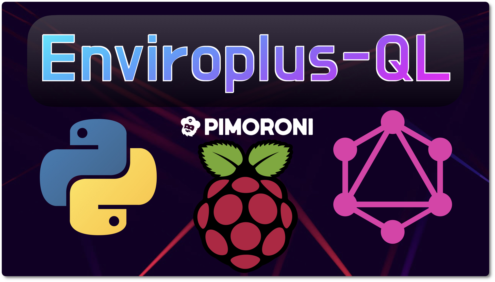
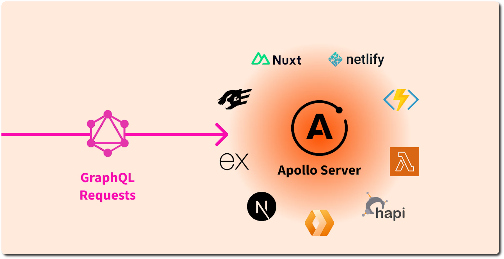
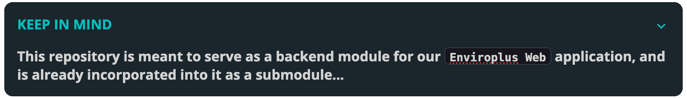

<div align="center">
    
</div>

<br>

<div align="center">


-yellow?style=plastic&logo=raspberrypi&logoColor=red)


</div>

<br>

<hr>
<div align="center"><strong>🚨 IMPORTANT NOTE 🚨 

 This Python module is meant to be used as a backend for our <b>`Enviro Web`</b> dashboard application, and other related projects that utilize the Enviro(+) Raspberry Pi HAT made by Pimoroni.</div>
<hr>

<br>


## 📝 How it Works
A GraphQL server allows clients to request exactly the data they need, making it more efficient than traditional REST APIs, which is exactly why it was chosen for the newest version of our Enviroplus Web Dashboard application.

FastAPI is a modern, fast (high-performance) web framework for building APIs with Python based on standard Python type hints. It bolsters the efficiency of our GraphQL server implementation in a number of ways:

- **Asynchronous Capability:** Supports asynchronous programming, allowing the server to handle many requests concurrently without blocking. This is particularly useful for I/O-bound operations like database queries.
- **Automatic Validation:** Automatically validates request data against the defined types, reducing the need for manual validation and improving reliability.
- **High Performance:** Built on top of Starlette for the web parts and Pydantic for the data parts, FastAPI is designed to be one of the fastest Python frameworks available.
- **Ease of Use:** The use of Python type hints makes it easy to write and maintain code, while also providing excellent editor support and auto-completion.
- **No Useless Data:** Allows clients to request exactly the data they need, making it more efficient than traditional REST APIs.

<br>

> **By combining GraphQL with FastAPI, you get a powerful, efficient, and easy-to-use server for querying sensor data from the Enviroplus Raspberry Pi HAT.**

<br>

## 🧩 Defining a Schema
In GraphQL applications, the schema specifies the queries that clients can make, the types of data that can be returned, and the mutations that can be performed to modify the data.

The schema for this project is defined in [`api/schema.py`](api/schema.py), and contains the key callback function that will end up being queried:

```python
import strawberry
from .types.env import Env, EnvPlus
from .types.env import get_env_data, get_env_data_plus

@strawberry.type
class Query:
    @strawberry.field(description="Query current environmental data for Standard Enviro HAT")
    async def current_readings(self) -> Env:
        return await get_env_data()
    @strawberry.field(description="Query current environmental data for Enviro+ HAT")
    async def current_readings_plus(self) -> EnvPlus:
        return await get_env_data_plus()

schema = strawberry.Schema(query=Query)
```

This schema utilizes a callback function that returns either an `Env` or `EnvPlus` object containing the current sensor readings at the time of the query. The class declarations for these objects can be found in [`api/types/env.py`](api/types/env.py):

```python
@strawberry.type(
    description="A snapshot of current environmental data"
)
class Env:
    temperature: float = strawberry.field(description="Current temperature reading in Celsius")
    humidity: float = strawberry.field(description="Current humidity reading")
    pressure: float = strawberry.field(description="Current pressure reading in mmHg")

@strawberry.type(
    description="A snapshot of current environmental data with additional gas measurements"
)
class EnvPlus(Env):
    co: float = strawberry.field(description="Reducing gas measurement of Carbon Monoxide")
    nh3: float = strawberry.field(description="Concentration measurement of Ammonia gas")
```

<br>

## 💫 Why Apollo?

> **Apollo** is a comprehensive, spec-compliant GraphQL server that's compatible with any GraphQL client. 

<div align="center">
    
</div>

<br>

Since Apollo can use data from any source, it makes for an excellent production-grade API server! **Moreover, it's also a great choice for this application specifically because of:**

- **Declarative Data Fetching**: Apollo allows you to write queries and mutations directly in your components, making data fetching declarative and easy to understand.
- **Caching**: Apollo Client includes an intelligent cache that can be used to store query results, reducing the need for repeated network requests and improving performance.
- **Tooling**: Apollo provides a suite of tools for development, including the Apollo Sandbox, which helps in debugging and optimizing queries.

<br>

<div align="center">
    
</div>

<br>

## ⚙️ Installation

**Clone the repository:**
```sh
$ git clone https://github.com/dedsyn4ps3/enviroplus-ql.git
$ cd enviroplus-ql
```

**Install dependencies using the included `setup.sh` script:**
```sh
$ bash ./setup.sh
```

<br>

## 🚀 Running the Server

**To start the server, use the following command(s):**

```sh
# Run in developer mode
$ fastapi dev server/main.py

# Launch in production mode, binding to all interfaces and a specific port
$ fastapi run --host 0.0.0.0 --port 8080 server/main.py
```

> **Instead of running these commands manually, simply run the `setup.sh` script**

<br>

## 🌟 Contributing

It doesn't matter if you're a brand new programmer or seasoned veteran, we're always looking for folks willing to contribute in any way they can! 

Since I'm the only maintainer of this project, it can be very easy sometimes for my full-time job to keep me away from projects every so often. It's with the help of you all in the community to point out possible bugs, as well as recommending possible features and updates.

If there's something you think could be refactored, improved, or simply have an idea for something new...reach out!

> **I can't promise that every thought or recommendation will lead to code changes, but I most certainly welcome the input!** 😎

<br>

## 📧 Contact

For assistance with any issues, please feel free to either [email us](mailto:support@nullsecurity.tech), or submit a bug report. 

**If you have an idea pertaining to code changes or possible additions, go ahead and submit a PR if you feel it could be helpful to the project!**

<br>

## 📄 License™

> **See [LICENSE.md](LICENSE.md) for all relevant information pertaining to licensing**